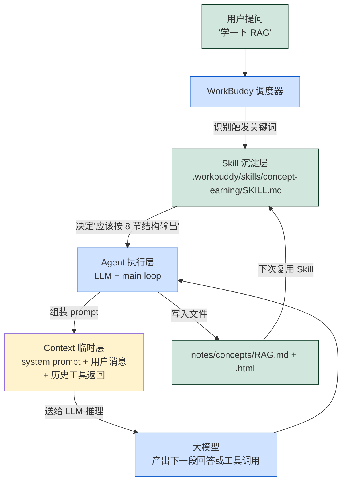
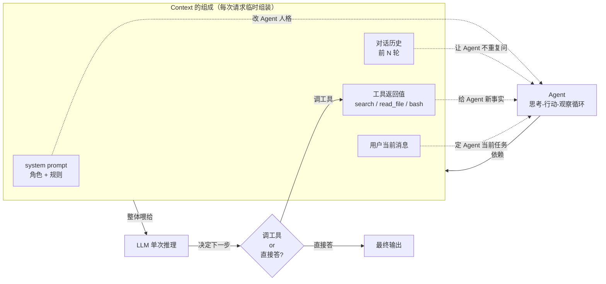
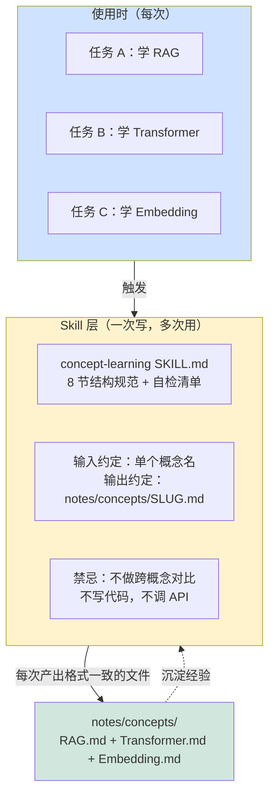

# 三个概念的关系：上下文 · Agent · Skill

> 本文不重复每个概念的独立解释（详见 `notes/concepts/`），而是把它们放在一张地图上，看清楚彼此怎么配合、谁负责什么、谁在什么位置生效。

---

## 一、三句话定位（TL;DR）

- **上下文（Context）** 是大模型工作时"眼前能看到的信息"。它每次请求临时组装，决定这一轮回答得对不对、好不好。
- **Agent** 是"能自己拿上下文、拿工具、按步骤干活的程序"。Agent 不只是一句话问答，而是循环：读上下文 → 思考 → 调工具 → 看结果 → 决定下一步。
- **Skill** 是"被提前写好的可复用工作说明书"。它把"在某场景下要怎么读上下文、要调哪些工具、输出什么格式"沉淀下来，下次遇到类似任务直接用。

简单记：**上下文是**临时输入**，Agent 是**执行者**，Skill 是**沉淀下来的方法论**。**

---

## 二、对比表（横向看差异）

| 维度 | 上下文 | Agent | Skill |
|------|--------|-------|-------|
| **本质** | 大模型本轮能看到的信息集合 | 能自主调用工具完成任务的程序 | 提前写好的任务说明 + 工作流 |
| **生命周期** | 每次请求临时组装，结束即销毁 | 进程级，持续运行直到任务完成 | 长期沉淀，跨任务复用 |
| **谁来写** | 由系统/用户/工具动态拼装 | 由开发者编写（也可由 LLM 生成） | 由人或 AI 编写并长期维护 |
| **载体** | prompt / messages / tool result | 一个 main loop + 工具集 | SKILL.md / 配置文件 / 文档 |
| **典型例子** | `system prompt + 历史消息 + 当前文件内容 + 工具返回值` | Claude Code、AutoGPT、LangChain Agent | WorkBuddy 的 `concept-learning` Skill |
| **常见误区** | "上下文越多越好" | "Agent 等于 ChatGPT" | "Skill 就是一段 prompt" |
| **谁更耗资源** | 中（占 token 配额） | 高（多轮调用） | 低（只读不跑） |

---

## 三、三者的关系图（Mermaid）

### 图 1：完整循环——Skill 沉淀方法论，Agent 拿去用，Context 给它喂信息



### 图 2：聚焦——"上下文如何影响 Agent 工作"



**关键点**：Agent 不是"自带智能"的，它**完全依赖**这一轮喂进去的上下文。

- 上下文里少了历史 → Agent 会重复问同一个问题
- 上下文里少了工具返回值 → Agent 的"观察"环节失效，会瞎猜
- 上下文里塞了过时的 system prompt → Agent 会按老规则走
- 上下文塞得太长 → 受 Lost-in-the-Middle 影响，中间信息被忽略

---

### 图 3：聚焦——"Skill 如何沉淀可复用的任务知识"



**关键点**：Skill 把"做某类任务的最佳实践"**外化**成可读、可版本控制、可被 AI 直接加载的文件。

| 没有 Skill 的世界 | 有 Skill 的世界 |
|-------------------|-----------------|
| 每次都要重新告诉 AI 怎么组织 | 触发词 → AI 自动按规范执行 |
| 输出格式全靠运气 | 强制 8 节结构，缺项自检 |
| 经验只在某次对话里 | 经验沉淀在 SKILL.md，跨会话复用 |
| 改一次流程要重写 prompt | 改一次 SKILL.md，所有后续任务自动跟进 |

---

## 四、协同工作：一次完整任务的三者配合（以"学一下 RAG"为例）

```
第 1 步  Skill 被触发
        用户说 "学一下 RAG"
        → WorkBuddy 调度器在 .workbuddy/skills/ 找到 concept-learning
        → 读取 SKILL.md 的 description 字段，判定匹配
        → 加载到当前 Agent 的 system prompt 里（这本身就是上下文的一部分）

第 2 步  Context 被组装
        → system prompt = 角色 + Skill 内容（8 节规范 + 自检清单）
        → 历史消息 = 之前对话轮次
        → 用户消息 = "学一下 RAG"

第 3 步  Agent 工作循环开始
        → LLM 收到上面拼起来的上下文
        → 按 Skill 规范，生成"目标、问题、地图、解释、应用、辨析、自检、来源"8 节
        → 调用工具：write_file 生成 md + html
        → 触发自检：8 项必须齐全，否则补
        → 输出 notes/concepts/RAG.md + RAG.html

第 4 步  沉淀回 Skill（可选）
        → 如果发现 Skill 规范不全（比如这次需要新章节），修改 SKILL.md
        → 下次学新概念时自动用新规范
        → 这是 Skill 区别于一次性 prompt 的关键
```

---

## 五、给 AI 小白的记忆口诀

```
上下文 = 这一轮它"看到"什么   （短期、临时、占 token）
Agent   = 它"怎么干"的执行者   （循环、决策、调工具）
Skill   = "怎么干"被沉淀下来    （长期、可复用、可版本管理）
```

三者关系一句话：**Skill 教 Agent 怎么用好每一轮的上下文。**

---

## 参考来源

- **Anthropic：Effective context engineering for AI agents**（官方工程博客）— 关于"如何塞上下文给 Agent"的实战经验
- **Lilian Weng "LLM Powered Autonomous Agents"**（博客）— Agent 规划/记忆/工具三件套的经典框架
- **《ReAct: Synergizing Reasoning and Acting in Language Models》**（论文，Yao et al., 2022）— Agent 循环（思考→观察→行动）的原始定义
- **Anthropic：Equipping agents for the real world with Agent Skills**（官方工程博客）— Skill 在生产 Agent 中的实际用法
- **WorkBuddy Skill 开发者文档**（官方文档）— 本作业用到的 Skill 体系